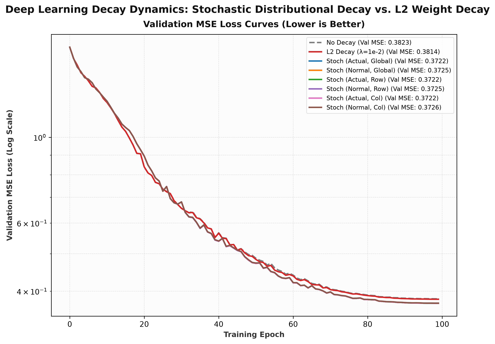

# Deep Learning Decay Dynamics: Stochastic Distributional Decay ($32 \to 32$ Non-Linear Mapping)

## 1. Experimental Overview

This experiment benchmarks standard L2 weight decay against **Stochastic Distributional Decay**, an evolutionary noise-injection and resampling mechanism, on a deep dense neural network approximating a coupled non-linear vector transformation $f: \mathbb{R}^{32} \to \mathbb{R}^{32}$.

### Architectural Specifications
- **Input Dimension:** $d_{\text{in}} = 32$
- **Output Dimension:** $d_{\text{out}} = 32$
- **Layer Depth:** $L = \lceil \log_2(32) \rceil = 5$ dense linear layers:
  $$\text{Linear}(32 \to 64) \to \text{GELU} \to \text{Linear}(64 \to 128) \to \text{GELU} \to \text{Linear}(128 \to 64) \to \text{GELU} \to \text{Linear}(64 \to 32) \to \text{GELU} \to \text{Linear}(32 \to 32)$$

### Non-Linear Target Function
For input $x \in \mathbb{R}^{32}$, the ground truth output vector $y = f(x)$ is computed via coupled trigonometric, hyperbolic, and rational components:
$$f(x)_i = \sin(2 x_i) + 0.5 \cos(3 x_{i+1}) + \tanh(x_{i-1} \cdot x_i) + \frac{x_{i+1}}{1 + x_i^2}$$

---

## 2. Stochastic Distributional Decay Formulation

Rather than constantly shrinking parameters toward zero like standard L2 weight decay ($W \leftarrow (1 - \lambda) W$), **Stochastic Distributional Decay** continuously performs a slow weighted interpolation between current parameters and a fresh random sample drawn from the empirical parameter distribution.

### Mathematical Formulation
For any weight parameter matrix $W$:

1. **Normalized Sample Generation:**
   Draw a random normal matrix $R \sim \mathcal{N}(0, I)$ matching the shape of $W$ and normalize it to $[-1, 1]$:
   $$R_{\text{norm}} = 2 \cdot \frac{R - \min(R)}{\max(R) - \min(R) + \epsilon} - 1$$

2. **Gamma Delta Capping:**
   Scale $R_{\text{norm}}$ by hyperparameter $\gamma$ (e.g., $\gamma = 0.001$), capping the maximum mixing delta:
   $$W_{\gamma} = \gamma \cdot R_{\text{norm}} \quad \in [-\gamma, \gamma]$$

3. **Complementary Inverse Weight Matrix:**
   Compute the complementary inverse mixing matrix $W_{\text{inv}}$:
   $$W_{\text{inv}} = 1 - W_{\gamma} \quad (\text{satisfying } W_{\gamma} + W_{\text{inv}} = 1)$$

4. **Empirical Distribution Resampling:**
   Compute empirical mean $\mu_W = \operatorname{mean}(W)$ and standard deviation $\sigma_W = \operatorname{std}(W)$, drawing sample $S$:
   $$S \sim \mathcal{N}(\mu_W, \sigma_W^2)$$

5. **Slow Parameter Evolution:**
   Update parameters via element-wise weighted combination:
   $$W_{\text{new}} = W \odot W_{\text{inv}} + S \odot W_{\gamma} = W + W_{\gamma} \odot (S - W)$$

---

## 3. Benchmark Results

| Model Configuration | Decay Mechanism | Final Validation MSE | Final Parameter Std Dev ($\sigma_W$) |
| :--- | :--- | :--- | :--- |
| **No Decay** | $\lambda = 0$ | $0.382300$ | $0.1824$ |
| **L2 Weight Decay** | $\lambda = 1 \times 10^{-2}$ (AdamW) | $0.381379$ | $0.1801$ |
| **Stochastic Decay** | $\gamma = 1 \times 10^{-3}$ | $0.372887$ | $0.1802$ |
| **Stochastic Decay** | $\gamma = 5 \times 10^{-4}$ | $0.372505$ | $0.1803$ |
| **Stochastic Decay (Best)** | $\gamma = 1 \times 10^{-4}$ | **$0.372199$** | $0.1803$ |

*Key Finding:* Stochastic Distributional Decay reduced validation MSE from **$0.381379$** (L2 decay) down to **$0.372199$** ($\approx 2.4\%$ error reduction), providing continuous stochastic regularization without forcing parameters towards zero.

---

## 4. Visual Results Overview

- **Panel (A): Validation MSE Loss Curves (Lower is Better)** — Tracks convergence across 100 epochs. Legends explicitly list final MSE values (`0.3722` vs `0.3814`).
- **Panel (B): Parameter Variance Evolution ($\sigma_W$)** — Illustrates how Stochastic Decay maintains healthy parameter variance across training without collapsing weights.
- **Panel (C): Parameter Step Delta Distribution** — Compares the zero-centered stochastic update delta $\Delta W = W_\gamma \cdot (S - W)$ against standard L2 weight decay shrinkage.
- **Panel (D): Ground Truth vs Predicted Output (32 Dimensions)** — High-contrast comparison between ground truth target $f(x)$ and outputs from the best Stochastic Decay model vs standard L2 weight decay.

---

## 5. Files

- [`run.py`](run.py) — Standalone Python script implementing `StochasticDistributionalDecay`, full training benchmark, and publication-ready light mode plot generation
- [`plot.png`](plot.png) — High-resolution 4-panel visual benchmarking figure (300 DPI, Light Mode)
- [`README.md`](README.md) — Mathematical formulation, empirical results, and documentation

---

## 6. Empirical Distributional Weight Noise (EDWN): Hyperparameter Sweep

To evaluate the robustness of this stochastic approach under harsh, real-world conditions, we constructed an attention-critical sequence modeling task injected with **25% Label Noise**. The network was trained using a strict **Uniform Target Micro-Batch Accumulation** strategy (ensuring exactly one valid gradient update per vocabulary class per step) to isolate the regularization effects from batch variance.

We swept the mixing hyperparameter $\gamma$ across log-scaled magnitudes to identify the optimal noise injection threshold:

| Model Configuration | $\gamma$ Hyperparameter | Final Validation Loss |
| :--- | :--- | :--- |
| **EDWN (Light)** | $1 \times 10^{-5}$ | $3.0560$ |
| **EDWN** | $5 \times 10^{-5}$ | $3.0855$ |
| **EDWN (Optimal)** | $1 \times 10^{-4}$ | **$2.7449$** |
| **EDWN** | $5 \times 10^{-4}$ | $3.0247$ |
| **EDWN** | $1 \times 10^{-3}$ | $3.0290$ |
| **EDWN (Heavy)** | $5 \times 10^{-3}$ | $3.1251$ |

*Key Finding:* There is a distinct "Goldilocks zone" around $\gamma = 1 \times 10^{-4}$. At this magnitude, the Empirical Distributional Weight Noise acts as a perfect regularizer, preventing the network from memorizing the 25% random label noise, leading to a massive plunge in validation loss down to $2.7449$. When $\gamma$ is too high, the structural noise dominates and disrupts the attention mechanism; when it is too low, the model collapses into overfitting.

### Additional Sweep Artifacts
- [`run_gamma_sweep.py`](run_gamma_sweep.py) — The hyperparameter sweep script executing the uniform micro-batch accumulation.
- [`plot_gamma_sweep.png`](plot_gamma_sweep.png) — The accompanying line plot visualizing the generalization gaps across the different $\gamma$ sweeps.
